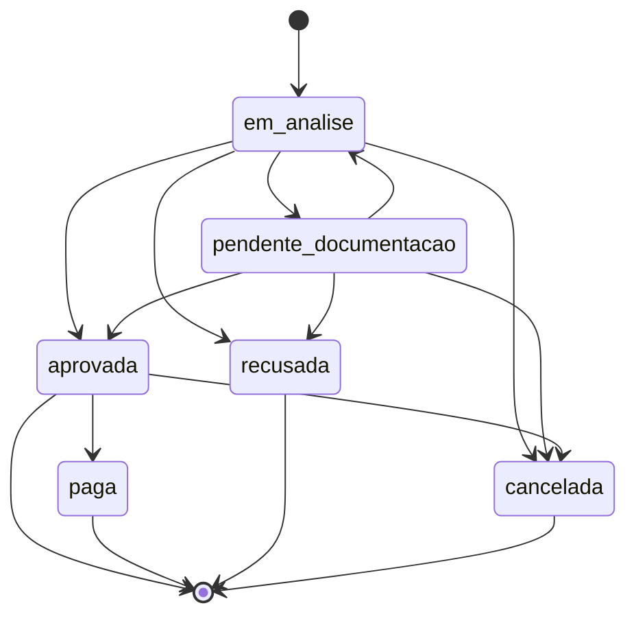
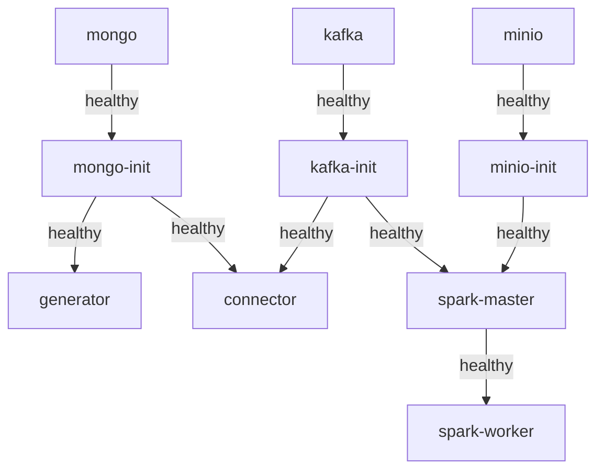

# Streaming de propostas de crédito — MongoDB, Kafka e Spark

Pipeline de dados que captura mudanças de estado de propostas de crédito
(consignado, cartão e FGTS) gravadas em MongoDB, propaga essas mudanças via
change streams para o Kafka, e as materializa em camadas bronze/silver/gold
sobre Delta Lake, usando Spark Structured Streaming de ponta a ponta.

Este é o quarto projeto do meu portfólio de Engenharia de Dados. Construí
tudo sem nenhum serviço de nuvem pago — todo componente roda em Docker
Compose, na mesma rede.

## Status do projeto

Estou construindo isso em fases, validando cada uma de ponta a ponta antes
de passar para a próxima. Por enquanto:

- [x] **Fase 1 — Ambiente e fonte operacional**: ambiente Docker completo e
      gerador de carga operacional
- [x] **Fase 2 — Conector de change streams**: resume token durável,
      `fullDocument`/`fullDocumentBeforeChange`, publicação no Kafka com
      confirmação antes do checkpoint, roteiro de resiliência
- [ ] Fase 3 — Bronze em streaming
- [ ] Fase 4 — Silver e estado atual
- [ ] Fase 5 — Gold, qualidade e observabilidade

As seções sobre exatamente-uma-vez de ponta a ponta, watermark/dado
atrasado, heterogeneidade de schema na camada analítica e a comparação
change streams × CDC do SQL Server vão entrar conforme eu implementar as
fases correspondentes — não faz sentido documentar uma decisão de código
que ainda não existe.

## Arquitetura de ponta a ponta (alvo do projeto completo)

```mermaid
flowchart LR
    subgraph f1["Fase 1 — pronto"]
        GEN["Gerador de carga\noperacional (Python)"]
    end
    GEN -->|insert / update / delete / replace| MONGO[("MongoDB\nreplica set rs0")]

    subgraph f2["Fase 2 — pronto"]
        CS["Conector de\nchange streams (Python)"]
    end
    MONGO -->|change stream| CS
    CS -->|chave = id_proposta| KAFKA[("Kafka\ntópico propostas.cdc")]

    subgraph f3["Fase 3 — planejado"]
        BRONZE["Spark Structured Streaming\nBronze"]
    end
    KAFKA --> BRONZE
    BRONZE -->|Delta| LAKE_B[("MinIO: bronze")]

    subgraph f4["Fase 4 — planejado"]
        SILVER["Spark: histórico de mudanças\n+ estado atual (merge)"]
    end
    LAKE_B --> SILVER
    SILVER -->|Delta merge| LAKE_S[("MinIO: silver")]

    subgraph f5["Fase 5 — planejado"]
        GOLD["Spark: agregações em janela\n+ checks de qualidade"]
    end
    LAKE_S --> GOLD
    GOLD -->|Delta| LAKE_G[("MinIO: gold")]
    LAKE_G --> DUCK["DuckDB\nconsultas de exemplo"]
```



## Modelo de dados e ciclo de vida (definido para o projeto inteiro)

Uma proposta tem campos comuns a qualquer tipo de produto, mais campos
específicos por tipo:

| Comuns | Consignado | Cartão | FGTS |
|---|---|---|---|
| `id_proposta`, `tipo_produto`, `cpf_cliente`, `nome_cliente`, `valor_solicitado`, `status`, `data_criacao`, `data_atualizacao` | `matricula`, `orgao_convenio`, `prazo_meses`, `taxa_juros`, `margem_consignavel` | `limite_solicitado`, `bandeira`, `score_credito` | `saldo_fgts_disponivel`, `percentual_antecipado`, `banco_parceiro` |

`id_proposta` é a chave de negócio da proposta e, desde a Fase 2, também a
chave de cada mensagem no Kafka — garante que todas as mudanças de uma
mesma proposta caem na mesma partição e mantêm ordem.

Ciclo de vida de status:



`recusada`, `paga` e `cancelada` são estados terminais. Além das transições
de status, o gerador de carga também produz:

- **Deletes**: exclusão de uma proposta criada por engano (erro
  operacional simulado) — remoção real do documento no Mongo.
- **Correções retroativas**: `replace` de um campo de negócio
  (`valor_solicitado`, `nome_cliente` ou `cpf_cliente`) sem alterar
  `status`, mas atualizando `data_atualizacao` (é tratada como qualquer
  escrita de auditoria — só não mexe no status da proposta).

## Fase 1 — o que existe hoje

### Ambiente Docker

Todo serviço roda no Compose, na mesma rede `credpipe-net`:

| Serviço | Papel |
|---|---|
| `mongo` + `mongo-init` | MongoDB `8.0.17` como replica set de nó único (`rs0`), iniciado automaticamente |
| `kafka` + `kafka-init` | Kafka `4.3.1` em modo KRaft (broker+controller combinado, sem ZooKeeper), tópico `propostas.cdc` (6 partições) |
| `minio` + `minio-init` | MinIO com os buckets `bronze`, `silver`, `gold` já criados |
| `spark-master` + `spark-worker` | Spark `3.5.8` standalone, imagem própria com os conectores Kafka + Delta Lake + S3A já embutidos |
| `generator` | Gerador de carga operacional (Python) |
| `connector` | Conector de change streams (Python, Fase 2) |

Os contêineres `*-init` existem porque o healthcheck de um serviço confirma
só que o processo está de pé — não que o replica set foi criado, ou que o
tópico/buckets existem. Cada `*-init` roda seu trabalho de forma idempotente
e fica vivo depois, sinalizando prontidão via um arquivo-sentinela que o
Compose usa como `condition: service_healthy`. Nenhum `sleep` fixo em
nenhum ponto da cadeia de inicialização — ver a seção "Decisões e
trade-offs", abaixo, para as versões exatas de cada imagem e por quê.

Ordem de inicialização:



### Gerador de carga operacional

Simula o sistema operacional que grava propostas no Mongo: cria propostas
dos três tipos, evolui o status conforme a máquina de estados acima, e
produz deletes e correções retroativas, tudo em loop com taxa configurável.
Código em [`generator/`](generator/), configurado inteiramente por
variáveis de ambiente (ver [`infra/.env.example`](infra/.env.example)):

| Variável | Papel |
|---|---|
| `EVENTS_PER_SECOND` | taxa alvo de operações por segundo |
| `RATIO_CONSIGNADO` / `RATIO_CARTAO` / `RATIO_FGTS` | peso relativo de cada tipo em propostas novas |
| `RATIO_NEW_VS_TRANSITION` | fração dos eventos que cria proposta nova vs. avança uma existente |
| `RATIO_DELETE` | fração das propostas recém-criadas marcadas para exclusão futura |
| `RATIO_CORRECAO` | fração dos eventos de transição que viram correção retroativa |
| `RANDOM_SEED` | opcional, fixa a semente para reproduzir a mesma sequência |

## Fase 2 — o que existe hoje

### Conector de change streams

Serviço Python (`connector/`) que abre um change stream na coleção
`propostas`, monta um envelope JSON por evento e publica no tópico
`propostas.cdc` com `id_proposta` como chave da mensagem. Roda como serviço
próprio no Compose, depende de `mongo-init` e `kafka-init` saudáveis.

O envelope publicado inclui `id_proposta`, `operation_type`, `cluster_time`,
`resume_token`, `document_key`, `full_document`, `full_document_before_change`
e `update_description` — serializados com `bson.json_util` (extended JSON
relaxado), para que a Fase 3 consiga ler o JSON diretamente sem reimplementar
a decodificação de tipos BSON (`ObjectId`, `datetime`, `Timestamp`).

| Variável | Papel |
|---|---|
| `KAFKA_DELIVERY_TIMEOUT_MS` / `KAFKA_REQUEST_TIMEOUT_MS` | timeouts do producer usados para detectar broker indisponível em segundos |
| `CHECKPOINT_COLLECTION` / `CHECKPOINT_ID` | onde o resume token é persistido (dentro do próprio MongoDB) |
| `BATCH_MAX_SIZE` / `BATCH_MAX_INTERVALO_MS` | tamanho/intervalo máximo de um lote antes de publicar e fazer checkpoint |
| `RETRY_BACKOFF_INICIAL_MS` / `RETRY_BACKOFF_MAXIMO_MS` | backoff exponencial ao perder conexão com Mongo ou Kafka |

O roteiro completo de resiliência (reinício do conector, queda do Kafka,
queda do Mongo, e resume token inválido/corrompido) está na seção
"Roteiro de resiliência (Fase 2)", mais abaixo.

## Como executar (Linux / WSL2 + Docker Desktop)

Pré-requisitos: Docker Desktop com integração WSL2 habilitada, rodando
dentro de uma distro WSL2 (os scripts assumem bash/paths Unix).

```bash
git clone <url-do-repositorio>
cd projeto-mongodb-streaming

# sobe tudo do zero (cria infra/.env, gera o CLUSTER_ID do Kafka, builda as
# imagens custom na primeira vez, sobe os serviços, espera todos saudáveis)
bash scripts/bootstrap.sh
```

Ao final, o script imprime as URLs úteis:

- MongoDB: `mongodb://localhost:27017/?replicaSet=rs0`
- MinIO console: <http://localhost:9001>
- Spark UI: <http://localhost:8080>
- Kafka: `localhost:9092`, tópico `propostas.cdc`

Para derrubar tudo (e limpar os volumes, deixando pronto para uma próxima
subida 100% do zero):

```bash
bash scripts/teardown.sh
```

### Roteiro de validação manual (Fase 1)

Confirma que o ambiente sobe de ponta a ponta numa máquina limpa. Todos os
comandos abaixo usam:

```bash
docker compose -f infra/docker-compose.yml --env-file infra/.env <comando>
```

**1. Subir o ambiente do zero** (`bash scripts/bootstrap.sh`) — esperado:
todos os serviços saudáveis sem intervenção manual e sem `sleep`; o script
só retorna quando `mongo`, `mongo-init`, `kafka`, `kafka-init`, `minio`,
`minio-init`, `spark-master` e `spark-worker` reportam `healthy`, e
`generator` está em execução.

**2. Confirmar o replica set do MongoDB**:

```bash
... exec mongo mongosh --quiet --eval "rs.status().myState"
```

Esperado: `1` (o nó único é PRIMARY).

**3. Confirmar o tópico Kafka**:

```bash
... exec kafka /opt/kafka/bin/kafka-topics.sh \
  --bootstrap-server localhost:9092 --describe --topic propostas.cdc
```

Esperado: `PartitionCount: 6`, `ReplicationFactor: 1`.

**4. Confirmar os buckets do MinIO**: `... exec minio-init mc ls local` —
esperado `bronze/`, `silver/`, `gold/`.

**5. Confirmar o gerador de carga**: `... logs -f generator` — esperado
logs mostrando propostas sendo criadas (`consignado`, `cartao`, `fgts`),
transições de status, correções retroativas e deletes ocasionais. Direto
no Mongo:

```bash
... exec mongo mongosh --quiet creditodb --eval "
  print('total de propostas: ' + db.propostas.countDocuments({}));
  printjson(db.propostas.aggregate([{\$group: {_id: '\$tipo_produto', total: {\$sum: 1}}}]).toArray());
  printjson(db.propostas.aggregate([{\$group: {_id: '\$status', total: {\$sum: 1}}}]).toArray());
"
```

Esperado: documentos dos três tipos de produto, campos específicos
diferentes por tipo, e distribuição de status coerente com o ciclo de vida
(mais propostas em estados iniciais do que terminais logo após subir).

**6. Smoke test do Spark (Kafka + Delta + S3A)** — confirma que os três
conectores embutidos na imagem funcionam, antes de existir pipeline de
streaming real:

```bash
... exec spark-master bash -c "cat > /tmp/smoke.py" <<'EOF'
from pyspark.sql import SparkSession

spark = SparkSession.builder.appName("fase1-smoke-test").getOrCreate()

dados = spark.range(5).withColumnRenamed("id", "valor")
dados.write.format("delta").mode("overwrite").save("s3a://bronze/_smoke")
lido = spark.read.format("delta").load("s3a://bronze/_smoke")
assert lido.count() == 5, "delta/s3a: contagem inesperada"
print("OK: delta + s3a (MinIO) funcionando, 5 linhas lidas de volta")

leitura_kafka = (
    spark.read.format("kafka")
    .option("kafka.bootstrap.servers", "kafka:19092")
    .option("subscribe", "propostas.cdc")
    .option("startingOffsets", "earliest")
    .load()
)
total_kafka = leitura_kafka.count()
print(f"OK: conector kafka funcionando, {total_kafka} mensagens no topico propostas.cdc")

spark.stop()
EOF

... exec spark-master /opt/spark/bin/spark-submit \
  --master spark://spark-master:7077 /tmp/smoke.py
```

Esperado: as duas linhas `OK: ...` impressas, sem exceções. Se a etapa 1
falhar, o problema está na config S3A/Delta
(`infra/spark/conf/spark-defaults.conf`) ou nas credenciais do MinIO; se a
etapa 2 falhar, o problema está no conector Kafka embutido na imagem ou
nos listeners do broker. Acompanhe pela Spark UI em
<http://localhost:8080> (master) e <http://localhost:8081> (worker)
enquanto o job roda.

**7. Teardown e nova subida (idempotência)**: `bash scripts/teardown.sh`
seguido de `bash scripts/bootstrap.sh` — esperado: ambiente sobe limpo de
novo, sem erros, com um novo `KAFKA_CLUSTER_ID` gerado automaticamente (o
antigo foi descartado junto com o volume `kafka-data`).

### Rodando os testes automatizados do gerador

```bash
cd generator
python -m venv .venv && source .venv/bin/activate
pip install -r requirements-dev.txt
pytest -q
```

Os testes cobrem a máquina de estados (nenhuma transição fora do ciclo
definido, estados terminais não têm saída), a validação de configuração
(variáveis de ambiente fora do intervalo esperado derrubam o serviço com
erro claro em vez de rodar com comportamento errado) e o contrato de que
uma correção retroativa nunca envia o campo `status` ao Mongo.

### Rodando os testes automatizados do conector

```bash
cd connector
python -m venv .venv && source .venv/bin/activate
pip install -r requirements-dev.txt
pytest -q
```

Os testes cobrem a extração de `id_proposta` (do `fullDocument`, do
`fullDocumentBeforeChange` em deletes, e o fallback para `documentKey._id`
quando nenhum dos dois está disponível), o backoff exponencial, o
repositório de checkpoint, e a detecção de falha de entrega no Kafka —
tudo com dublês (`ProdutorFalso`, `ColecaoFalsa`), sem precisar de Mongo ou
Kafka reais rodando. A resiliência de verdade (reconexão, backoff sob
falha real, resume token inválido) só se prova rodando o ambiente de
verdade e derrubando cada peça — é o que o roteiro abaixo documenta.

### Roteiro de resiliência (Fase 2)

Os três cenários exigidos, mais um extra, todos rodados de verdade contra
o ambiente com Fase 1 + Fase 2 no ar. Comandos no formato:

```bash
docker compose -f infra/docker-compose.yml --env-file infra/.env <comando>
```

**Cenário 1 — reinício do próprio conector**:

```bash
... exec mongo mongosh --quiet creditodb --eval \
  "db.checkpoints.findOne().resume_token._data"
... restart connector
... logs --tail=20 connector
```

Observado: o conector recebe SIGTERM, loga "sinal 15 recebido, encerrando
após o lote em andamento...", publica e confirma o lote que estava em
memória antes de sair, e loga "conector encerrado.". Na inicialização
seguinte, loga "retomando a partir do resume token persistido" e volta a
publicar sem lacunas na sequência de `resume_token`. Na pior hipótese (o
processo morrer entre a confirmação no Kafka e a gravação do checkpoint),
o pior caso é reprocessar o último lote — nunca perder eventos.

**Cenário 2 — queda do Kafka**:

```bash
... stop kafka
... logs --tail=20 connector   # aguardar ~15-20s
... start kafka
... logs --tail=20 connector
```

Observado ao derrubar: em poucos segundos (não minutos) o producer reporta
falha de entrega (`KafkaError{code=_MSG_TIMED_OUT}`), o conector loga
"falha ao publicar lote no Kafka (...), tentando novamente em Xs..." com
backoff exponencial (1s, 2s, 4s, 8s...), e continua tentando o **mesmo**
lote em memória sem avançar o cursor do MongoDB — confirmei observando que
`db.propostas` continua recebendo escritas do gerador normalmente durante
toda a queda, sem qualquer relação com o estado do conector. Observado ao
religar: o conector reconecta sozinho e publica, em sequência rápida, os
lotes acumulados durante a queda (no tamanho máximo configurado, drenando
o backlog), voltando ao ritmo normal em seguida. Nenhum evento gerado
durante a queda foi perdido.

**Cenário 3 — queda do MongoDB**:

```bash
... stop mongo
... logs --tail=20 connector   # aguardar ~30-40s (selecao de servidor do driver)
... start mongo
... logs --tail=20 connector
```

Observado ao derrubar: o conector loga "MongoDB indisponível
(...AutoReconnect...), tentando novamente em Xs..." com o mesmo backoff
exponencial, sem derrubar o processo — a detecção leva ~30s porque é
regida pelo `serverSelectionTimeoutMS` padrão do driver pymongo. Observado
ao religar: assim que o replica set volta a responder, o conector reabre o
change stream a partir do último resume token persistido e volta a
publicar normalmente — como o volume `mongo-data` preserva a configuração
do replica set, não é necessário rodar `rs.initiate()` de novo.

**Cenário extra — resume token inválido/corrompido**: não é um dos três
pedidos, mas é o comportamento mais importante de provar — o requisito
explícito é "se o token ficar mais antigo que o oplog disponível, falhar
com mensagem clara pedindo recarga, em vez de pular eventos
silenciosamente":

```bash
... exec mongo mongosh --quiet creditodb --eval "
db.checkpoints.updateOne(
  {_id: 'conector-propostas'},
  {\$set: {resume_token: {_data: 'token-invalido'}}}
)
"
... up -d --force-recreate connector
... logs --tail=15 connector
... ps -a connector
```

Observado: o conector levanta `ResumeTokenInvalidoError` com uma mensagem
explícita nomeando a coleção e o `_id` do checkpoint a remover, o processo
termina com código de saída 1, e o container **fica parado** (não entra em
crash-loop) — o serviço `connector` usa `restart: "no"` exatamente para
que essa falha fique visível via `docker compose ps`, em vez de se perder
numa sequência infinita de reinícios. Nenhum evento é pulado
silenciosamente: o conector recusa avançar sem um token utilizável. Para
recuperar (decisão consciente, não automática):

```bash
... exec mongo mongosh --quiet creditodb --eval \
  "db.checkpoints.deleteOne({_id: 'conector-propostas'})"
... up -d connector
```

Sem checkpoint, o conector reinicia a partir de "agora" — eventos gerados
entre a invalidação do token e a limpeza do checkpoint são perdidos. Essa
é uma decisão do operador, feita olhando `docker compose ps`/logs, nunca
uma decisão automática do código.

## Decisões e trade-offs (Fase 1)

**Coloquei tudo em Docker Compose, nada solto no host.** O replica set do
MongoDB anuncia seus membros pelo hostname interno da rede do Compose
(`mongo`, ver `infra/mongo/init-replica-set.sh`). Um client rodando fora
dessa rede consegue abrir a conexão inicial (a porta 27017 está exposta),
mas ao descobrir a topologia do replica set recebe esse hostname interno e
falha ao tentar alcançá-lo — um erro difícil de diagnosticar porque a
conexão parece funcionar por um instante. Preferi manter todo client dentro
da rede a contorná-lo com configuração especial de DNS no host.

**Fiz o replica set de nó único já na Fase 1, mesmo sem consumidor ainda.**
Change streams do MongoDB são implementados sobre o oplog, que só existe em
replica sets. Um MongoDB standalone não tem de onde emitir os eventos que a
Fase 2 vai consumir — por isso o `mongo-init` já roda `rs.initiate()`
automaticamente, antes mesmo de o conector de change streams existir.

**Escolhi imagens oficiais, não Bitnami.** O catálogo gratuito do Bitnami
foi descontinuado em agosto/2025 (imagens antigas migraram para
`bitnamilegacy`, sem atualização) — muito material de referência sobre
Kafka/Spark/MinIO em Docker ainda assume imagens Bitnami ou versões antigas
do Spark. Fixei um conjunto de versões oficiais (docker-library, projeto
Apache ou MinIO Inc.) e mutuamente compatíveis antes de escrever qualquer
Dockerfile ou compose:

| Componente | Imagem | Versão |
|---|---|---|
| MongoDB | `mongo` | `8.0.17` |
| Kafka | `apache/kafka` | `4.3.1` |
| MinIO server | `minio/minio` | `RELEASE.2025-09-07T16-13-09Z-cpuv1` |
| MinIO client | `minio/mc` | `RELEASE.2025-08-13T08-35-41Z-cpuv1` |
| Spark | `spark` (docker-library) | `3.5.8-scala2.12-java11-python3-ubuntu` |
| Delta Lake | `delta-spark_2.12` | `3.3.2` |
| Conector Kafka p/ Spark | `spark-sql-kafka-0-10_2.12` | `3.5.8` |
| Hadoop AWS (S3A) | `hadoop-aws` | `3.3.4` |
| AWS SDK bundle | `aws-java-sdk-bundle` | `1.12.262` |

Regras de compatibilidade por trás desses pares fixos:

- `spark-sql-kafka-0-10_2.12` **tem que** ser a mesma versão exata do
  Spark — não é versionado independentemente, é publicado junto de cada
  release.
- `delta-spark:3.3.2` é o build oficial testado contra toda a linha
  Spark 3.5.x (Scala 2.12). Subir para Spark 4.0 exigiria Delta 4.x
  (Scala 2.13 only, JDK 17 mínimo) — salto de compatibilidade maior do
  que o necessário para este projeto.
- `hadoop-aws:3.3.4` foi compilado e testado contra exatamente
  `aws-java-sdk-bundle:1.12.262`. Outra combinação causa
  `NoSuchMethodError`/`ClassNotFoundException` só no primeiro acesso a
  `s3a://`, não no build da imagem — por isso trato o par como atômico,
  nunca atualizo um sem o outro.

Tags de patch (`8.0.17`, `3.5.8`, releases do MinIO) evoluem com o tempo —
se ao reconstruir a imagem numa data bem posterior a setembro/2026 uma tag
não existir mais, confirmo com `docker manifest inspect <imagem>:<tag>` e
escolho o patch mais próximo dentro da mesma linha menor (ex.: `3.5.x`),
atualizando `SPARK_VERSION`/`SPARK_IMAGE_TAG` juntos no Dockerfile. E
`minio/minio` removeu o `curl` da imagem em releases recentes, então todo
healthcheck contra MinIO usa `mc ready local`, nunca
`curl .../minio/health/live`.

**Assei os JARs do Spark na imagem, nunca uso `--packages` em runtime.**
Baixar as dependências do Maven Central a cada `spark-submit` exige
internet disponível toda vez e é fonte comum de falha silenciosa (timeout,
proxy, Maven Central fora do ar). O Dockerfile do Spark resolve a árvore
transitiva do conector Kafka e do Delta Lake uma única vez, em tempo de
`docker build`, e congela os `.jar` resultantes na imagem.

**Reservei `id_proposta` como chave da futura mensagem Kafka.** Ainda não
havia producer Kafka na Fase 1, mas já modelei `id_proposta` como
identificador estável justamente para isso: garantir que todas as
mudanças de uma mesma proposta caiam na mesma partição e preservem ordem.
O conector da Fase 2 usa exatamente esse campo como chave, sem precisar
adaptar nada no modelo de dados.

**Já gero deletes e correções na Fase 1, não só a partir da Fase 2.** Mesmo
sem consumidor de change streams ainda, o gerador já produz esses dois
padrões de evento porque prefiro validá-los cedo (via os testes em
`generator/tests/`) a descobrir só na Fase 4 que a semântica de "correção
não muda status, mas atualiza `data_atualizacao`" ficou ambígua.

## Decisões e trade-offs (Fase 2)

**Habilitei `fullDocumentBeforeChange` desde a Fase 1, mesmo sem o conector
existir ainda.** Por padrão, um evento de `update` do change stream traz só
o delta (`updateDescription.updatedFields`), não o documento inteiro — por
isso configurei `full_document="updateLookup"`, que busca o documento
completo no momento da leitura. Só que isso não resolve `delete`: um
delete não tem "documento atual" nenhum para buscar. Para conseguir extrair
`id_proposta` (e qualquer outro campo) de um delete, habilitei também
`full_document_before_change="whenAvailable"`, que traz o documento como
ele era *antes* da mudança — isso exige `changeStreamPreAndPostImages`
habilitado na coleção (`infra/mongo/init-replica-set.sh` já faz isso via
`createCollection`/`collMod`). **Custo real, não hipotético**: cada
update/delete numa coleção monitorada grava uma cópia extra do documento
numa coleção interna (`config.system.preimages`) — dobra o I/O de escrita
para gravar essas pré-imagens. Aceitei esse custo porque, sem ele, todo
delete perderia `id_proposta` (o `documentKey` do change stream só traz o
`_id` interno do Mongo, não campos de negócio) e cairia no fallback
descrito abaixo.

**`id_proposta` tem um fallback documentado, não é garantido 100% das
vezes.** Se `fullDocument`/`fullDocumentBeforeChange` vierem nulos por
qualquer motivo (ex.: pré-imagem expirou, ou uma corrida rara em que o
documento já foi modificado de novo no momento do `updateLookup`), o
conector usa `documentKey._id` como chave e marca
`chave_derivada_de_fallback: true` no envelope — prefiro isso a derrubar o
pipeline ou inventar um `id_proposta` falso.

**Resume token persistido dentro do próprio MongoDB, não em arquivo.**
Guardo o token numa coleção (`checkpoints`) no mesmo banco `creditodb`, não
num volume Docker separado. Como o conector só observa a coleção
`propostas` especificamente (não o banco inteiro), escritas na coleção de
checkpoint não entram no próprio change stream que ele está lendo — sem
esse detalhe, seria um problema circular. A vantagem: não preciso gerenciar
mais um volume, e o checkpoint herda a mesma durabilidade do replica set
que já preciso ter de qualquer forma.

**Resume token só avança depois que o Kafka confirma o lote inteiro.** O
conector lê eventos do Mongo, acumula um lote (por tamanho ou por tempo,
o que vier primeiro — `BATCH_MAX_SIZE`/`BATCH_MAX_INTERVALO_MS`), publica
todos, espera a confirmação de entrega (`flush()` do `confluent-kafka`), e
só então grava o checkpoint com o resume token do último evento do lote.
Se o processo morrer entre a confirmação do Kafka e a gravação do
checkpoint, o pior caso na reinicialização é reprocessar esse lote — nunca
perder um evento. Isso é at-least-once, não exatamente-uma-vez: escolhi
`enable.idempotence=True` no producer (evita duplicar por causa de retry
interno do próprio producer), mas duplicação de ponta a ponta em caso de
crash é uma possibilidade aceita — a Fase 4 vai lidar com isso via
deduplicação no merge do Delta, não aqui.

**Escolhi `confluent-kafka` em vez de `kafka-python`.** O `kafka-python`
original está sem atividade de manutenção há anos, e o fork que tentou
mantê-lo vivo foi arquivado em 2025. `confluent-kafka` publica wheels
pré-compilados (`manylinux`) que instalam direto via pip em
`python:3.11-slim`, sem precisar de toolchain de compilação na imagem, e
tem suporte de primeira classe para os requisitos deste conector
(`acks=all`, confirmação de entrega antes de checkpoint, timeouts finos
para detectar broker fora do ar em segundos).

**O serviço `connector` não reinicia sozinho (`restart: "no"`).** Um resume
token inválido/expirado é, por definição, um erro que não se resolve
tentando de novo automaticamente — exige decisão humana (reload). Deixei o
container parar e ficar visivelmente parado (`docker compose ps` mostra
`Exited`) em vez de entrar num crash-loop silencioso disfarçando o
problema.

## Estrutura do repositório

```
infra/            docker-compose.yml, Dockerfile do Spark, scripts de init
generator/        gerador de carga operacional (Fase 1), com generator/tests/
connector/        conector de change streams (Fase 2), com connector/tests/
spark-jobs/       jobs Spark de bronze/silver/gold (Fases 3-5 — ainda não implementados)
scripts/          bootstrap.sh, teardown.sh, generate-kafka-cluster-id.sh
```

Roteiros de validação manual e de resiliência ficam no próprio README (ver
"Roteiro de validação manual (Fase 1)" e "Roteiro de resiliência
(Fase 2)", acima) — nada de arquivo markdown solto por fase.

## Próximos passos

O que pretendo adicionar nas próximas fases:

- **Fase 3**: bronze em streaming real (Structured Streaming, não
  micro-batch disfarçado), checkpoint.
- **Fase 4**: histórico de mudanças, estado atual via merge, watermark e
  política de dado atrasado (com teste), tratamento de heterogeneidade de
  schema, tratamento de delete/replace na camada analítica — e é aqui que
  entram a seção **"Resiliência"** completa e a comparação **change
  streams × CDC do SQL Server**.
- **Fase 5**: agregações gold, checks de qualidade com reconciliação
  Mongo × gold, métricas operacionais do pipeline, consultas DuckDB
  versionadas, capturas de tela da Spark UI em streaming / tópico Kafka /
  DuckDB.
