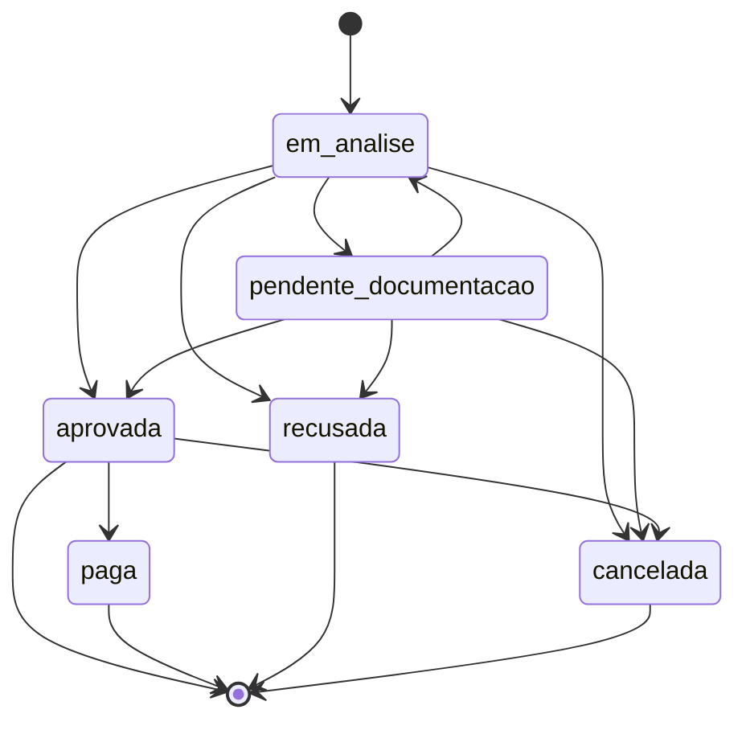
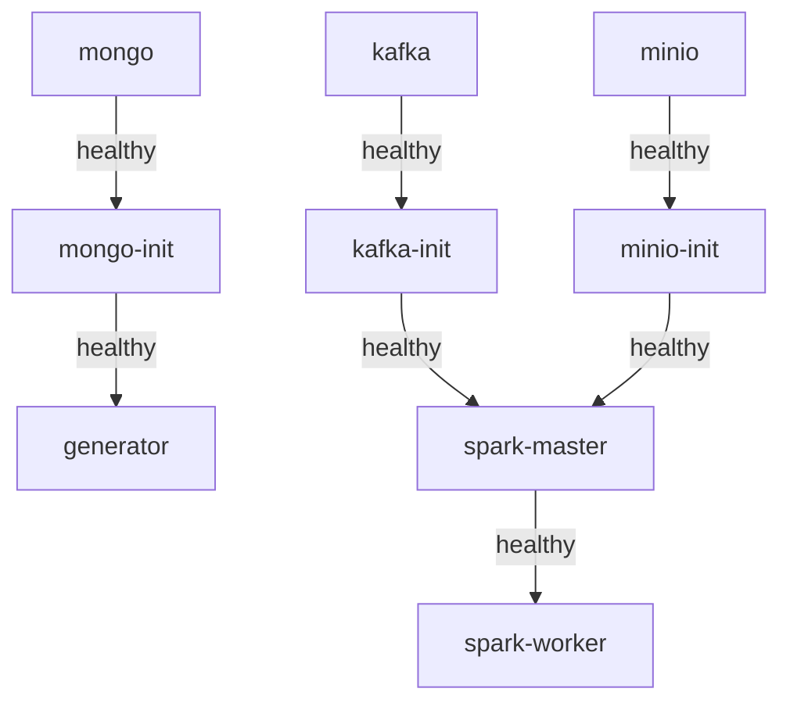

# Streaming de propostas de crédito — MongoDB, Kafka e Spark

Pipeline de dados que captura mudanças de estado de propostas de crédito
(consignado, cartão e FGTS) gravadas em MongoDB, propaga essas mudanças via
change streams para o Kafka, e as materializa em camadas bronze/silver/gold
sobre Delta Lake, usando Spark Structured Streaming de ponta a ponta.

Este é o quarto projeto do meu portfólio de Engenharia de Dados. Construí
tudo sem nenhum serviço de nuvem pago — todo componente roda em Docker
Compose, na mesma rede.

## Status do projeto

Estou construindo isso em fases, validando cada uma de ponta a ponta antes
de passar para a próxima. Por enquanto:

- [x] **Fase 1 — Ambiente e fonte operacional** (o que este README já
      descreve em detalhe: ambiente Docker completo e gerador de carga
      operacional)
- [ ] Fase 2 — Conector de change streams
- [ ] Fase 3 — Bronze em streaming
- [ ] Fase 4 — Silver e estado atual
- [ ] Fase 5 — Gold, qualidade e observabilidade

As seções sobre `fullDocument`, exatamente-uma-vez, watermark/dado atrasado,
heterogeneidade de schema e a comparação change streams × CDC do SQL Server
vão entrar conforme eu implementar as fases correspondentes — não faz
sentido documentar uma decisão de código que ainda não existe.

## Arquitetura de ponta a ponta (alvo do projeto completo)

```mermaid
flowchart LR
    subgraph f1["Fase 1 — pronto"]
        GEN["Gerador de carga\noperacional (Python)"]
    end
    GEN -->|insert / update / delete / replace| MONGO[("MongoDB\nreplica set rs0")]

    subgraph f2["Fase 2 — planejado"]
        CS["Conector de\nchange streams (Python)"]
    end
    MONGO -->|change stream| CS
    CS -->|chave = id_proposta| KAFKA[("Kafka\ntópico propostas.cdc")]

    subgraph f3["Fase 3 — planejado"]
        BRONZE["Spark Structured Streaming\nBronze"]
    end
    KAFKA --> BRONZE
    BRONZE -->|Delta| LAKE_B[("MinIO: bronze")]

    subgraph f4["Fase 4 — planejado"]
        SILVER["Spark: histórico de mudanças\n+ estado atual (merge)"]
    end
    LAKE_B --> SILVER
    SILVER -->|Delta merge| LAKE_S[("MinIO: silver")]

    subgraph f5["Fase 5 — planejado"]
        GOLD["Spark: agregações em janela\n+ checks de qualidade"]
    end
    LAKE_S --> GOLD
    GOLD -->|Delta| LAKE_G[("MinIO: gold")]
    LAKE_G --> DUCK["DuckDB\nconsultas de exemplo"]
```



## Modelo de dados e ciclo de vida (definido para o projeto inteiro)

Uma proposta tem campos comuns a qualquer tipo de produto, mais campos
específicos por tipo:

| Comuns | Consignado | Cartão | FGTS |
|---|---|---|---|
| `id_proposta`, `tipo_produto`, `cpf_cliente`, `nome_cliente`, `valor_solicitado`, `status`, `data_criacao`, `data_atualizacao` | `matricula`, `orgao_convenio`, `prazo_meses`, `taxa_juros`, `margem_consignavel` | `limite_solicitado`, `bandeira`, `score_credito` | `saldo_fgts_disponivel`, `percentual_antecipado`, `banco_parceiro` |

`id_proposta` é a chave de negócio da proposta e, a partir da Fase 2, será
também a chave da mensagem no Kafka — garante que todas as mudanças de uma
mesma proposta caem na mesma partição e mantêm ordem.

Ciclo de vida de status:



`recusada`, `paga` e `cancelada` são estados terminais. Além das transições
de status, o gerador de carga também produz:

- **Deletes**: exclusão de uma proposta criada por engano (erro
  operacional simulado) — remoção real do documento no Mongo.
- **Correções retroativas**: `replace` de um campo de negócio
  (`valor_solicitado`, `nome_cliente` ou `cpf_cliente`) sem alterar
  `status`, mas atualizando `data_atualizacao` (é tratada como qualquer
  escrita de auditoria — só não mexe no status da proposta).

## Fase 1 — o que existe hoje

### Ambiente Docker

Todo serviço roda no Compose, na mesma rede `credpipe-net`:

| Serviço | Papel |
|---|---|
| `mongo` + `mongo-init` | MongoDB `8.0.17` como replica set de nó único (`rs0`), iniciado automaticamente |
| `kafka` + `kafka-init` | Kafka `4.3.1` em modo KRaft (broker+controller combinado, sem ZooKeeper), tópico `propostas.cdc` (6 partições) |
| `minio` + `minio-init` | MinIO com os buckets `bronze`, `silver`, `gold` já criados |
| `spark-master` + `spark-worker` | Spark `3.5.8` standalone, imagem própria com os conectores Kafka + Delta Lake + S3A já embutidos |
| `generator` | Gerador de carga operacional (Python) |

Os contêineres `*-init` existem porque o healthcheck de um serviço confirma
só que o processo está de pé — não que o replica set foi criado, ou que o
tópico/buckets existem. Cada `*-init` roda seu trabalho de forma idempotente
e fica vivo depois, sinalizando prontidão via um arquivo-sentinela que o
Compose usa como `condition: service_healthy`. Nenhum `sleep` fixo em
nenhum ponto da cadeia de inicialização — ver a seção "Decisões e
trade-offs", abaixo, para as versões exatas de cada imagem e por quê.

Ordem de inicialização:



### Gerador de carga operacional

Simula o sistema operacional que grava propostas no Mongo: cria propostas
dos três tipos, evolui o status conforme a máquina de estados acima, e
produz deletes e correções retroativas, tudo em loop com taxa configurável.
Código em [`generator/`](generator/), configurado inteiramente por
variáveis de ambiente (ver [`infra/.env.example`](infra/.env.example)):

| Variável | Papel |
|---|---|
| `EVENTS_PER_SECOND` | taxa alvo de operações por segundo |
| `RATIO_CONSIGNADO` / `RATIO_CARTAO` / `RATIO_FGTS` | peso relativo de cada tipo em propostas novas |
| `RATIO_NEW_VS_TRANSITION` | fração dos eventos que cria proposta nova vs. avança uma existente |
| `RATIO_DELETE` | fração das propostas recém-criadas marcadas para exclusão futura |
| `RATIO_CORRECAO` | fração dos eventos de transição que viram correção retroativa |
| `RANDOM_SEED` | opcional, fixa a semente para reproduzir a mesma sequência |

## Como executar (Linux / WSL2 + Docker Desktop)

Pré-requisitos: Docker Desktop com integração WSL2 habilitada, rodando
dentro de uma distro WSL2 (os scripts assumem bash/paths Unix).

```bash
git clone <url-do-repositorio>
cd projeto-mongodb-streaming

# sobe tudo do zero (cria infra/.env, gera o CLUSTER_ID do Kafka, builda as
# imagens custom na primeira vez, sobe os serviços, espera todos saudáveis)
bash scripts/bootstrap.sh
```

Ao final, o script imprime as URLs úteis:

- MongoDB: `mongodb://localhost:27017/?replicaSet=rs0`
- MinIO console: <http://localhost:9001>
- Spark UI: <http://localhost:8080>
- Kafka: `localhost:9092`, tópico `propostas.cdc`

Para derrubar tudo (e limpar os volumes, deixando pronto para uma próxima
subida 100% do zero):

```bash
bash scripts/teardown.sh
```

Roteiro completo de validação manual (replica set, tópico, buckets, geração
de carga, smoke test do Spark com Kafka+Delta+S3A, idempotência do
teardown/bootstrap): [`tests/phase1/smoke_test.md`](tests/phase1/smoke_test.md).

### Rodando os testes automatizados do gerador

```bash
cd generator
python -m venv .venv && source .venv/bin/activate
pip install -r requirements-dev.txt
pytest -q
```

Os testes cobrem a máquina de estados (nenhuma transição fora do ciclo
definido, estados terminais não têm saída), a validação de configuração
(variáveis de ambiente fora do intervalo esperado derrubam o serviço com
erro claro em vez de rodar com comportamento errado) e o contrato de que
uma correção retroativa nunca envia o campo `status` ao Mongo.

## Decisões e trade-offs (Fase 1)

**Coloquei tudo em Docker Compose, nada solto no host.** O replica set do
MongoDB anuncia seus membros pelo hostname interno da rede do Compose
(`mongo`, ver `infra/mongo/init-replica-set.sh`). Um client rodando fora
dessa rede consegue abrir a conexão inicial (a porta 27017 está exposta),
mas ao descobrir a topologia do replica set recebe esse hostname interno e
falha ao tentar alcançá-lo — um erro difícil de diagnosticar porque a
conexão parece funcionar por um instante. Preferi manter todo client dentro
da rede a contorná-lo com configuração especial de DNS no host.

**Fiz o replica set de nó único já na Fase 1, mesmo sem consumidor ainda.**
Change streams do MongoDB são implementados sobre o oplog, que só existe em
replica sets. Um MongoDB standalone não tem de onde emitir os eventos que a
Fase 2 vai consumir — por isso o `mongo-init` já roda `rs.initiate()`
automaticamente, antes mesmo de o conector de change streams existir.

**Escolhi imagens oficiais, não Bitnami.** O catálogo gratuito do Bitnami
foi descontinuado em agosto/2025 (imagens antigas migraram para
`bitnamilegacy`, sem atualização) — muito material de referência sobre
Kafka/Spark/MinIO em Docker ainda assume imagens Bitnami ou versões antigas
do Spark. Fixei um conjunto de versões oficiais (docker-library, projeto
Apache ou MinIO Inc.) e mutuamente compatíveis antes de escrever qualquer
Dockerfile ou compose:

| Componente | Imagem | Versão |
|---|---|---|
| MongoDB | `mongo` | `8.0.17` |
| Kafka | `apache/kafka` | `4.3.1` |
| MinIO server | `minio/minio` | `RELEASE.2025-09-07T16-13-09Z-cpuv1` |
| MinIO client | `minio/mc` | `RELEASE.2025-08-13T08-35-41Z-cpuv1` |
| Spark | `spark` (docker-library) | `3.5.8-scala2.12-java11-python3-ubuntu` |
| Delta Lake | `delta-spark_2.12` | `3.3.2` |
| Conector Kafka p/ Spark | `spark-sql-kafka-0-10_2.12` | `3.5.8` |
| Hadoop AWS (S3A) | `hadoop-aws` | `3.3.4` |
| AWS SDK bundle | `aws-java-sdk-bundle` | `1.12.262` |

Regras de compatibilidade por trás desses pares fixos:

- `spark-sql-kafka-0-10_2.12` **tem que** ser a mesma versão exata do
  Spark — não é versionado independentemente, é publicado junto de cada
  release.
- `delta-spark:3.3.2` é o build oficial testado contra toda a linha
  Spark 3.5.x (Scala 2.12). Subir para Spark 4.0 exigiria Delta 4.x
  (Scala 2.13 only, JDK 17 mínimo) — salto de compatibilidade maior do
  que o necessário para este projeto.
- `hadoop-aws:3.3.4` foi compilado e testado contra exatamente
  `aws-java-sdk-bundle:1.12.262`. Outra combinação causa
  `NoSuchMethodError`/`ClassNotFoundException` só no primeiro acesso a
  `s3a://`, não no build da imagem — por isso trato o par como atômico,
  nunca atualizo um sem o outro.

Tags de patch (`8.0.17`, `3.5.8`, releases do MinIO) evoluem com o tempo —
se ao reconstruir a imagem numa data bem posterior a setembro/2026 uma tag
não existir mais, confirmo com `docker manifest inspect <imagem>:<tag>` e
escolho o patch mais próximo dentro da mesma linha menor (ex.: `3.5.x`),
atualizando `SPARK_VERSION`/`SPARK_IMAGE_TAG` juntos no Dockerfile. E
`minio/minio` removeu o `curl` da imagem em releases recentes, então todo
healthcheck contra MinIO usa `mc ready local`, nunca
`curl .../minio/health/live`.

**Assei os JARs do Spark na imagem, nunca uso `--packages` em runtime.**
Baixar as dependências do Maven Central a cada `spark-submit` exige
internet disponível toda vez e é fonte comum de falha silenciosa (timeout,
proxy, Maven Central fora do ar). O Dockerfile do Spark resolve a árvore
transitiva do conector Kafka e do Delta Lake uma única vez, em tempo de
`docker build`, e congela os `.jar` resultantes na imagem.

**Reservei `id_proposta` como chave da futura mensagem Kafka.** Ainda não
há producer Kafka na Fase 1 (isso é Fase 2), mas já modelei
`id_proposta` como identificador estável justamente para isso: garantir que
todas as mudanças de uma mesma proposta caiam na mesma partição e preservem
ordem quando o conector de change streams existir.

**Já gero deletes e correções na Fase 1, não só a partir da Fase 2.** Mesmo
sem consumidor de change streams ainda, o gerador já produz esses dois
padrões de evento porque prefiro validá-los cedo (via os testes em
`generator/tests/`) a descobrir só na Fase 4 que a semântica de "correção
não muda status, mas atualiza `data_atualizacao`" ficou ambígua.

## Estrutura do repositório

```
infra/            docker-compose.yml, Dockerfile do Spark, scripts de init
generator/        gerador de carga operacional (Fase 1)
connector/        conector de change streams (Fase 2 — ainda não implementado)
spark-jobs/       jobs Spark de bronze/silver/gold (Fases 3-5 — ainda não implementados)
scripts/          bootstrap.sh, teardown.sh, generate-kafka-cluster-id.sh
tests/phase1/     roteiro de validação manual da Fase 1
```

## Próximos passos

O que pretendo adicionar nas próximas fases:

- **Fase 2**: conector de change streams, resume token durável, escolha de
  `fullDocument` e seu custo, roteiro de resiliência (queda do serviço, do
  Kafka, do Mongo).
- **Fase 3**: bronze em streaming real (Structured Streaming, não
  micro-batch disfarçado), checkpoint.
- **Fase 4**: histórico de mudanças, estado atual via merge, watermark e
  política de dado atrasado (com teste), tratamento de heterogeneidade de
  schema, tratamento de delete/replace na camada analítica — e é aqui que
  entram a seção **"Resiliência"** completa e a comparação **change
  streams × CDC do SQL Server**.
- **Fase 5**: agregações gold, checks de qualidade com reconciliação
  Mongo × gold, métricas operacionais do pipeline, consultas DuckDB
  versionadas, capturas de tela da Spark UI em streaming / tópico Kafka /
  DuckDB.
